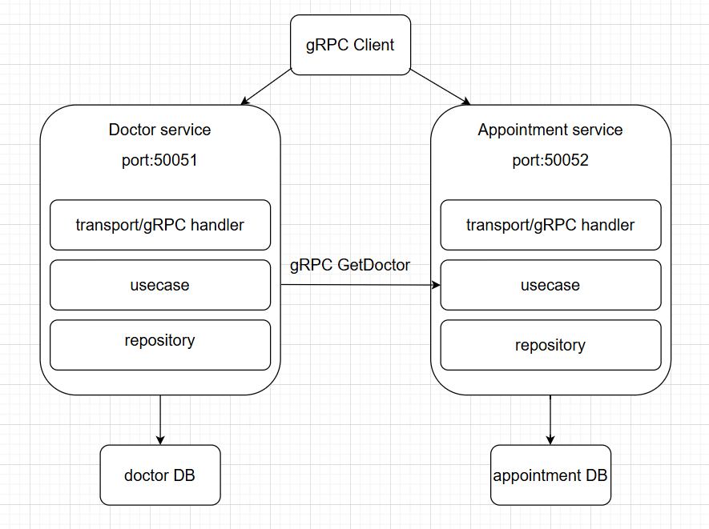

# Medical Scheduling Platform — gRPC Migration

## Project overview and purpose
The Medical Scheduling Platform is a two-service system for managing doctors and appointments. In this version, all communication is handled exclusively through gRPC, replacing the previous REST-based transport layer. Domain logic, Clean Architecture layering, and bounded-context boundaries are preserved from Assignment 1.

## Service responsibilities
- Doctor Service (port 50051) — manages doctor profiles. Owns its own PostgreSQL database.
- Appointment Service (port 50052) — manages appointments. Validates doctor existence by calling Doctor Service over gRPC before creating or updating an appointment.

## Folder structure and dependency flow

doctor-service/

      ├── cmd/
      └── internal/
            ├── model/
            ├── usecase/
            ├── repository/
            ├── transport/grpc/
            └── app/
            └── proto/
                  └── doctorpb/

appointment-service/

      ├── cmd/
      └── internal/
            ├── model/
            ├── usecase/
            ├── repository/
            ├── transport/grpc/
            └── app/
            └── proto/
                  ├── appointmentpb/
                  └── doctorpb/

Dependency direction: transport → usecase → repository → model

## How to install protoc and regenerate stubs

1. Install protoc from https://grpc.io/docs/protoc-installation/
2. Install Go plugins:

            go install google.golang.org/protobuf/cmd/protoc-gen-go@latest

            go install google.golang.org/grpc/cmd/protoc-gen-go-grpc@latest
3. Regenerate stubs:

            cd doctor-service/proto

                  protoc --go_out=. --go-grpc_out=. doctor.proto

            cd appointment-service/proto

                  protoc --go_out=. --go-grpc_out=. appointment.proto

## How to run the project

Start Doctor Service first, then Appointment Service.

Terminal 1:

      cd doctor-service

            go run ./cmd/doctorService

Terminal 2:

      cd appointment-service

            go run ./cmd/appointmentService

## Inter-service communication
When an appointment is created, the Appointment Service calls DoctorService.GetDoctor over gRPC. If the doctor exists, the appointment is created. If NOT_FOUND is returned, a FailedPrecondition error is returned to the client. If the Doctor Service is unreachable, an Unavailable error is returned.

## Failure scenario
If Doctor Service is unavailable, the Appointment Service returns gRPC status code 14 UNAVAILABLE with message "doctor service unavailable". In a production system this would require a timeout policy, a retry strategy for transient failures, and a circuit breaker to prevent cascading failures.

## REST vs gRPC trade-offs

* When to choose gRPC: internal microservice communication where performance and strict contracts matter.
* When to choose REST: public APIs, browser clients, or simple integrations.

## Why a shared database was not used
Each service owns its own data. A shared database would create tight coupling — a schema change in one service would break another, turning the system into a distributed monolith.

## Architecture diagram
