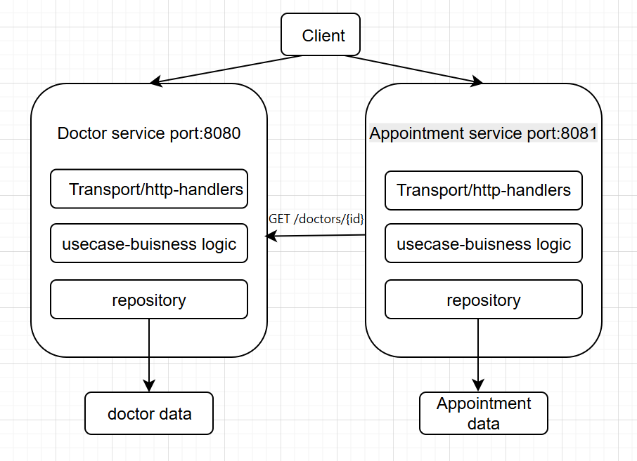

# Medical Scheduling Platform

## Project overview and purpose
The Medical Scheduling Platform is a system for managing doctors and appointments. It's divided into two microservices so that each can develop, deploy, and scale independently, without affecting the other.

## Service responsibilities
- Doctor Service (port 8080) — manages doctor profiles. It stores data in its own in-memory storage and is independent of other services.
- Appointment Service (port 8081) — manages appointments. Before creating an appointment, it verifies the doctor's existence via an HTTP request to Doctor Service.

## Folder structure and dependency flow

doctor-service/

├── cmd/         
└── internal/             

      ├── model/       
      ├── usecase/     
      ├── repository/  
      ├── transport/   
      └── app/                        

appointment-service/

├── cmd/         
└── internal/

      ├── model/       
      ├── usecase/     
      ├── repository/  
      ├── transport/   
      └── app/ 

direction of dependencies: transport → usecase → repository → model

## Inter-service communication
When an appointment is created, the Appointment Service performs a GET /doctors/{id} to the Doctor Service. If the response is 200, the doctor exists, and the appointment is created. If 404, a "doctor not found" error is returned.

## How to run the project

* in 1st terminal
cd doctor-service
go run ./cmd/doctorService

* in 2nd terminal
cd appointment-service
go run ./cmd/appointmentService

## Why a shared database was not used
Each service owns its own data. A shared database would create tight coupling between services—a schema change in one would break another. This would turn the system into a distributed monolith.

## Failure scenario

If Doctor Service is unavailable when a record is created, the Appointment Service returns a error "doctor service unavailable" error and logs the failure. In a production system, this would require a timeout, a retry strategy for transient failures, and a circuit breaker to prevent cascading failures.

## Architecture diagram 

